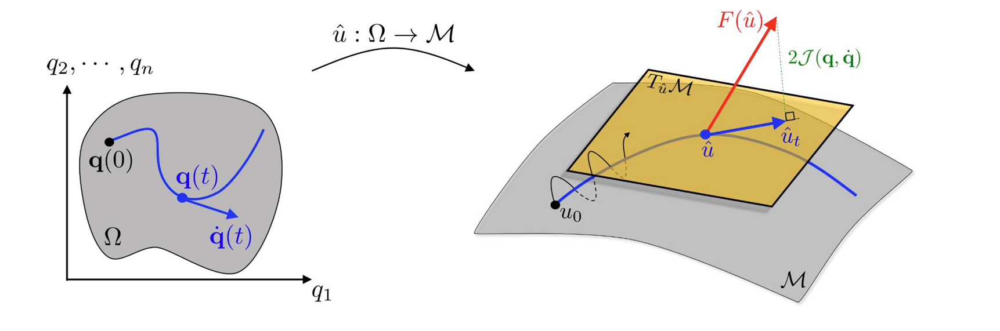
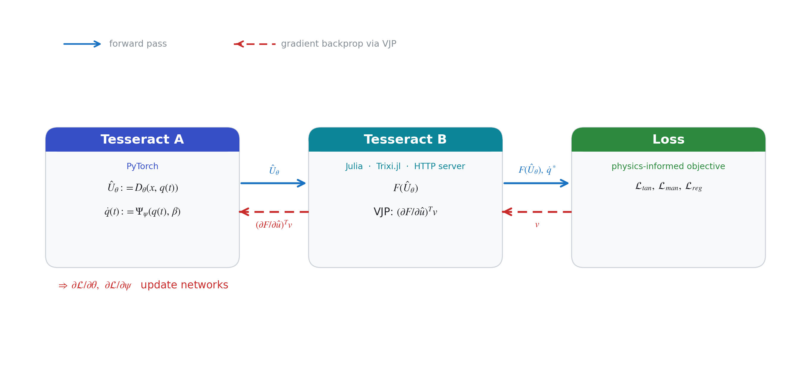
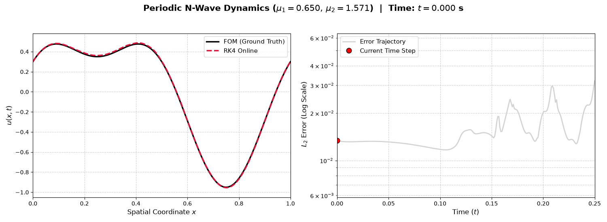

# Physics-Informed Differentiable Learning for High-Order Nonlinear ROMs

This repository implements a physics-informed differentiable learning framework for Reduced-Order Modeling (ROM) of hyperbolic partial differential equations (PDEs), specifically benchmarked on the parameterized 1D Inviscid Burgers' equation (N-Wave initial condition). 

By coupling a PyTorch neural network with a high-order Discontinuous Galerkin (DG) solver implemented in Julia (`Trixi.jl`) via the **Tesseract** framework, this project computes exact analytical Vector-Jacobian Products (VJPs) to prevent tangent space collapse and ensure long-term physical stability.

## 📂 Repository Structure

Below is an overview of the core files and directories included in this repository:

* **`solver.jl`** — High-fidelity Full-Order Model (FOM) solver configuration using `Trixi.jl` with Lobatto-Legendre basis functions and shock-capturing capabilities.
* **`generate_data.jl`** — Script to generate high-resolution FOM simulation snapshots across the parameter space ($\mu_1, \mu_2$) and save them to HDF5 format.
* **`dataset.py`** — PyTorch `Dataset` utility for loading HDF5 simulation data, coordinates, and quadrature weights.
* **`model.py`** — Neural network architecture comprising a convolutional encoder ($E_\phi$) and a continuous coordinate-based MLP decoder ($D_\theta$).
* **`losses.py`** — Composite physics-informed loss formulations (manifold reconstruction, mechanistic tangent projection, and Gram matrix regularization).
* **`train.py`** — Two-phase training script implementing decoupled manifold fitting followed by joint fine-tuning.
* **`online.py`** — Script for running real-time online ROM rollouts and evaluating performance against FOM ground truth.
* **`test_vjp.jl`** — Verification script ensuring the analytical discrete adjoint VJPs match finite differences to machine precision.
* **`config.toml`** — Global configuration settings for mesh resolution ($K$), polynomial degree ($p$), time horizon ($T$), and sampling bounds.
* **`dg_flux_tesseract/`** — Contains the Tesseract integration modules, including the Julia HTTP server (`burgers_server.jl`) and the Python API wrapper (`tesseract_api.py`).

## 📊 Project Report Summary

The high-level methodology, geometric manifold properties, and quantitative benchmarks are summarized below:

## 🎥 Online Simulation Visualization

Below is a dynamic visualization comparing the Full-Order Model (FOM) ground truth against the real-time ROM online predictions, alongside the tracking of the relative error over time:

